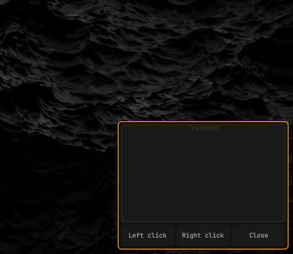

# Omaglide for Omarchy



**Omaglide** is a large, touch-first relative pointer pad for Omarchy tablets and touch devices. It provides a full virtual trackpad experience with tap-to-click, multi-touch gestures, and a floating window that can be freely repositioned anywhere on screen. It is part of the optional **Omablet** tablet suite, but installs and works independently.

---

## Features

### Movable & Repositionable Floating Window
- **Drag Anywhere on Screen**: Grab the top header bar with a finger or mouse to freely reposition Omaglide anywhere on your display.
- **Visual Grip Handle**: Centered pill handle illuminates with your theme's accent color while active.
- **Double-Tap Corner Reset**: Double-tap or double-click the top header bar to instantly snap Omaglide back to its default bottom-right position.
- **Boundary Clamping**: Coordinates are automatically clamped within screen limits, preventing the window from sliding off-screen or getting lost during tablet rotation (portrait/landscape) or resolution changes.
- **Position Persistence**: Retains your chosen screen position across open/close toggles during your session.
- **Direct Close Buttons**: Dismiss the trackpad via the header's top-right close icon or the large bottom **Close** button.

### Touchpad Gestures & Pointer Input
- **Relative Pointer Movement**: Drag a single finger on the pad to move the mouse cursor across the screen with calibrated 1.6x touch acceleration.
- **Tap-to-Click (Left Click)**: Single-tap the touchpad with one finger to dispatch a standard left mouse click.
- **Double-Tap (Double Click)**: Double-tap rapidly on the touchpad to execute a standard double-click (e.g. open apps, select words, expand folders).
- **Two-Finger Tap (Right Click)**: Tap with two fingers on the touchpad to open context menus.
- **Two-Finger Drag (Vertical Scroll)**: Drag two fingers up or down to scroll documents and web pages via the virtual mouse wheel.
- **Drag vs. Tap Protection**: Motion tracking ensures moving the pointer never triggers an accidental tap when lifting your finger.
- **Debounce & Synthesized Event Shield**: Click debounce logic prevents duplicate inputs on compositors that mirror touch events as mouse events.

### Dedicated Action Buttons
- **Touch-First Buttons**: Generous bottom button row with **Left click**, **Right click**, and **Close**.
- **Touch & Mouse Handlers**: Fully responsive to native Wayland touch events and standard mouse clicks.
- **Visual Feedback**: The trackpad surface and buttons illuminate subtly when active.

---

## Gesture & Controls Reference

| Gesture / Action | Target | Device | Function |
| :--- | :--- | :--- | :--- |
| **Drag** | Top header bar | Touch / Mouse | Reposition the trackpad on screen |
| **Double-tap / Double-click** | Top header bar | Touch / Mouse | Reset position to bottom-right corner |
| **Single drag** | Trackpad | Touch / Mouse | Move the mouse pointer |
| **Single tap** | Trackpad | Touch / Mouse | **Left click** |
| **Double tap** | Trackpad | Touch / Mouse | **Double click** |
| **Two-finger tap** | Trackpad | Touch | **Right click** (context menu) |
| **Two-finger drag** | Trackpad | Touch | **Vertical scroll** |
| **Right-click / Wheel** | Trackpad | Mouse | Right click / Scroll wheel fallback |
| **Tap / Click** | Bottom buttons | Touch / Mouse | Left click, Right click, or Close panel |
| **Tap / Click** | Header close icon | Touch / Mouse | Close panel |

---

## Omablet Suite

Omaglide works standalone and pairs seamlessly with companion Omablet plugins:
- [Omablet](https://github.com/frostmute/omarchy-omablet) — Tablet-mode rotation and desktop controls.
- [Omaqwerty](https://github.com/frostmute/omarchy-omaqwerty) — Docked and floating touch keyboard with full QWERTY modifiers and numpad.

---

## Install

```sh
omarchy plugin add https://github.com/frostmute/omarchy-omaglide.git --enable
```

---

## One-Time Pointer Setup

Omaglide uses `ydotool` to emit Wayland virtual pointer events via `/dev/uinput`. Run the bundled setup script in a visible terminal:

```sh
~/.config/omarchy/plugins/io.github.frostmute.onscreen-trackpad/setup.sh
```

The script will:
1. Install `ydotool` (via `omarchy pkg add ydotool` or `pacman`).
2. Add your user account to the `input` group.
3. Enable and start the `ydotool` user service (`systemctl --user enable --now ydotool.service`).

> [!NOTE]
> Log out and log back in (or reboot) after running the setup script so your user's group membership in `input` takes effect.

---

## Usage & Shortcuts

- **Bar Widget**: Click the trackpad icon (**󰟸**) on the Omarchy bar to toggle Omaglide.
- **CLI / Keybinding**: Toggle Omaglide via the shell IPC command:
  ```sh
  omarchy-shell shell toggle io.github.frostmute.onscreen-trackpad
  ```
- To bind a custom Hyprland shortcut in `~/.config/hypr/hyprland.conf`:
  ```ini
  bind = SUPER, T, exec, omarchy-shell shell toggle io.github.frostmute.onscreen-trackpad
  ```

---

## Remove

```sh
omarchy plugin remove io.github.frostmute.onscreen-trackpad
```

*Note: Removing the plugin does not remove `ydotool` or revoke the `input` group, as they may be shared with other tools.*

---

## Security

`ydotool` interacts with `/dev/uinput` to inject synthetic pointer events. Ensure only trusted scripts and services have access to your virtual input devices.

---

## License

MIT
